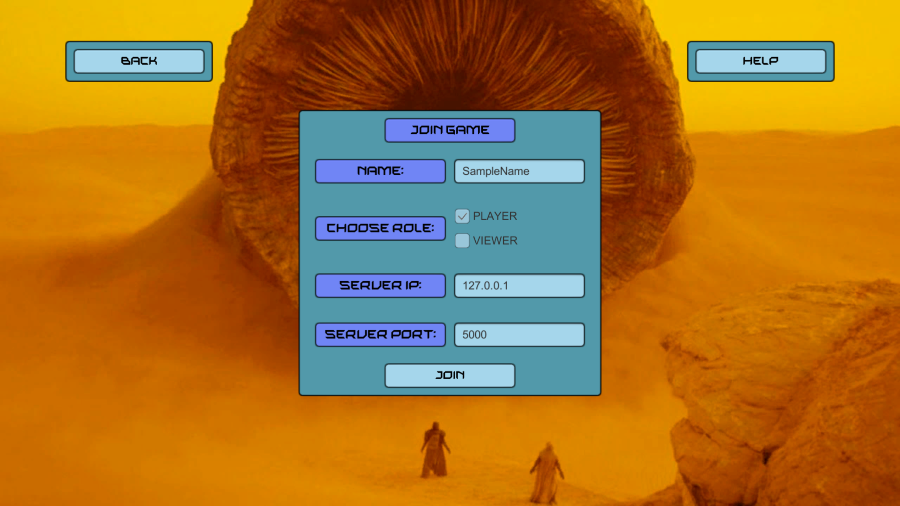

# Deserts of Dune - Team 08

_*Deserts of Dune*_ ist ein Multiplayer-Spiel, welches im Rahmen des Softwaregrundprojekts 2021/2022 entwickelt wird. Es wurde in der Sprache C# bzw. mit .NET entwickelt, wobei Visual Studio und Unity verwendet wurden

# Team
Das ist das Team 08. Das Team besteht aus folgenden Mitgliedern: 

- Leonhard Alkewitz
- Louis Bock
- Alexander Fink
- Jannis Kieselbach 
- Felix Schoppe
- Niklas Schuerrle

# Installation
Dieses Projekt kann wie folgt verwendet werden, um das Spiel zu spielen: 
1. Repository klonen
2. Unity herunterladen und das Projekt in Unity/Dune importieren
3. Client in Unity ausführen oder bauen
4. Den Server und KI-Client wie im Benutzerhandbuch starten.

# Dokumenation
## Pflichtenheft 
Das Pflichtenheft wird durch eine Pipeline automatisch gebaut, das heißt die entsprechend Latex-Datei wird automatisch compiled und als Artefakt gespeichert. Die aktuellste Version des Pflichtenhefts findet sich [hier](https://github.com/LeverageAlex/DuneRTS/tree/main/Documentation/Requirement_specification_document/Pflichtenheft.pdf). 

Außerdem enthält das Pflichtenheft den Architekturentwurf für das Projekt, also die Komponenten- und Klassendiagramme.

Für Abgaben oder sonstige Information ist immer dieses Pflichtenheft zu verwenden.

## Benutzerhandbuch
Genauso wie das Pflichtenheft wird auch das Benutzerhandbuch automatisch erstellt und findet sich [hier](https://github.com/LeverageAlex/DuneRTS/tree/main/Documentation/Benutzerhandbuch.pdf).
Dieses Benutzerhandbuch beinhaltet ebenso eine Anleitung, wie man den Server und den KI-Client starten kann

# Test
Der aktuelle Testreport befindet sich [hier](https://gitlab.informatik.uni-ulm.de/sopra/ws21-deserts-of-dune/teams/team08/-/jobs/artifacts/refactor/pipeline/raw/public?job=deploy-coverage-report)

# Ingame Aufnahmen

# Lizenzen
## Models
"bomb" (https://skfb.ly/6y6wE) by lostsoundzz is licensed under Creative Commons Attribution (http://creativecommons.org/licenses/by/4.0/)  
Sandworm: https://sketchfab.com/3d-models/death-worm-8054ab29b40e4cdbb3b2daf9cacc5688 CC-BY-4.0  
Häuser-Embleme: https://dune.fandom.com/de/wiki/H%C3%A4userwappen CC-BY-SA 

Standard Unity Asset Store EULA:  
Explosion particles: https://assetstore.unity.com/packages/essentials/asset-packs/standard-assets-for-unity-2018-4-32351  
Helicopter: https://assetstore.unity.com/packages/3d/vehicles/air/military-helicopter-ii-9472  
Character Models: https://assetstore.unity.com/packages/3d/characters/medieval-cartoon-warriors-90079

## Audio
Sword sound: https://mixkit.co/free-sound-effects/sword/  Mixkit Sound Effects Free License  
Spice pickup-sound: https://www.zapsplat.com/music/game-sound-high-pitched-ping-plonky-synth/ (Sound from Zapsplat.com)  
Atomic fly sound: https://www.youtube.com/watch?v=MZwsO6H_FYo free  
Music from <a href="https://pixabay.com/?utm_source=link-attribution&amp;utm_medium=referral&amp;utm_campaign=music&amp;utm_content=18816">Pixabay</a>  
Helicopter https://www.youtube.com/watch?v=2RtDgTm6rn4 free  

## Software

| Software (Version) | Link |
|--------------------|------|
| Unity (Version 2020.3.33f1) | unhttps://unity.com |
| Visual Studio (Community 2022) | https://visualstudio.microsoft.com/de/ |
| Visual Studio for Mac (2019 und 2022) | https://visualstudio.microsoft.com/de/ |
| .NET Core (Version 6.0) | https://dotnet.microsoft.com/en-us/download/dotnet/6.0 |
| .NET Core (Version 3.1) | https://dotnet.microsoft.com/en-us/download/dotnet/| 3.1 |
| SonarQube (Version 9.5) | https://www.sonarqube.org/downloads/ |
| Coverage Report-Generator | https://www.nuget.org/packages/vdotnet-reportgenerator-globaltool |
| Discord | https://discord.comv |
| GitLab | https://gitlab.informatik.uni-ulm.de |
| Draw.io | https://app.diagrams.net |
| Doxygen | https://doxygen.nl |

## verwendete Bibliotheken 

| Bibliothek | Link | Lizenz |
|------------|------|--------|
| GameData | - | eigene Software |
| CommandLineParser | https://github.com/commandlineparser/commandline | MIT license |
| Coverlet | https://github.com/coverlet-coverage/coverlet v MIT license |
| Newtonsoft | https://www.newtonsoft.com/json | MIT license |
| NUnit | https://nunit.org | MIT license |
| NUnit3 Testadapter | https://docs.nunit.org/articles/vs-test-adapter/Index.html | MIT license |
| Serilog | https://serilog.net | Apache-2.0 |
| Serilog Console | https://github.com/serilog/serilog-sinks-console |  Apache-2.0 |
| Serilog File | https://serilog.net | Apache-2.0 |
| Wegsacket-Sharp | https://github.com/sta/websocket-sharp | MIT license |

