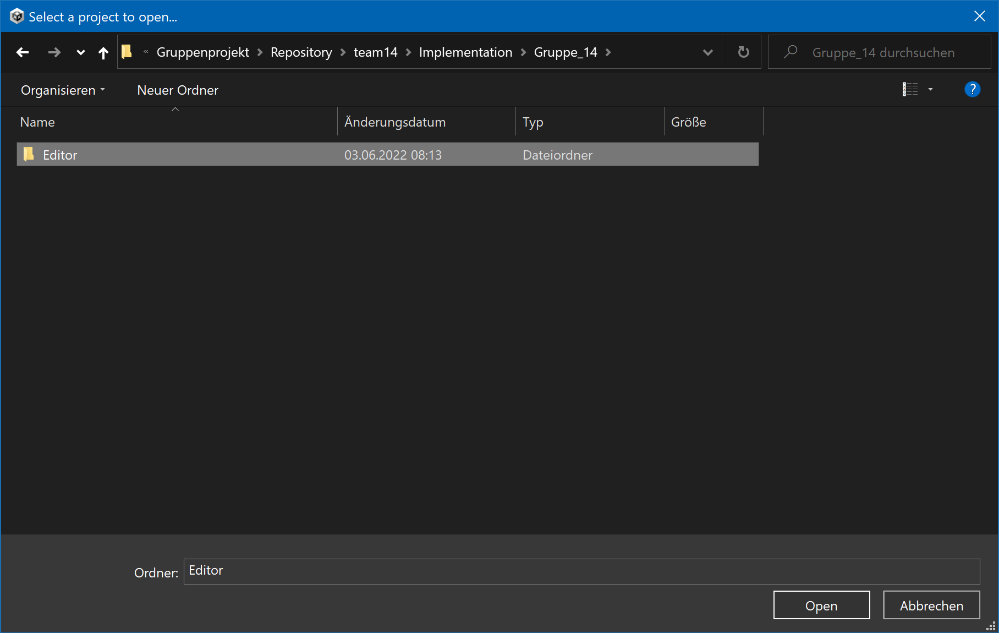
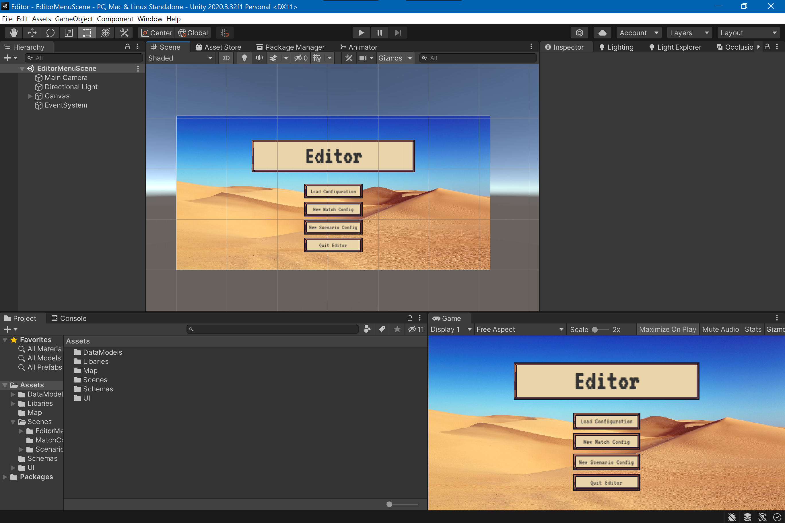
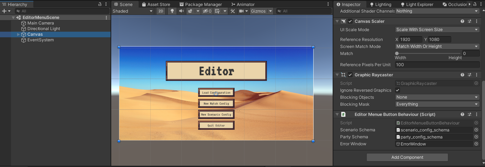

# README
## Getting started
### Installation
Opening the editor is rather easy if unity or specially unity hub is already installed on your computer. If not, just go to https://unity3d.com/de/get-unity/download and dowload and install the unity hub. 
Within unity hub you can now go to >Installs to manage and install the untiy version you like. For the editor we used Unity version 2020.3.32f1 and recommend you to do the same. The version used by our team can be found via > Installs > Install Editor > Archive > download archive. Now you are on the website where you can dowload our recommended version of unity.

### Opening the project
After installing unity you can now open our editor by clicking > Projects > Open. In the pop up file browser you choose the folder "Editor" as shown in the image below and click > open. Now unity should properly open the project. The process of opening the project may take some time if the project is opend the first time.

## Working in the Project
After the project is loaded you should see something like this.

If not, go to the bottom left hand side into the folder "Scenes". There you can find 3 other folders containing the data and scripts for the 3 different scenes (EditorMenue, MatchConfigEditor and ScenarioConfigEditor). By double clicking on the ".unity" file in one of this folders you can open up the scene in your 3d workspace. 

### Finding the right files
In generall all Scripts for the behaviour of UI-elements are in the corresponding Scenes folders. All other scripts are based in the DataModels folder and are only used for representing or converting data.

## How to implement the changes
### Updating the schemas
When the new schemas become available all you have to do is to replace the current files in the folder "Schemas". After this you should check if the reference in the script that uses them for validation is still set. Therefor you have to open the EditorMenue scene and click on the canvas. In the inspector window you will find a script which has the schemas set as references. If these fields are empty ("None (Text Asset)") simply add them by dragging the schema files into the empty field.
The result can be seen in the next image.

### Scenario changes
Here are all the files that need to be changed for the scenario (Just search for them with the search bar):
1. FieldType.cs (Add enum with the name defined in the standardisation!!!)
2. In Assets > Assets > UI > Materials create a Heliport Material
3. In Assets > Map add a new prefab tile like the others with the material above asigned
4. In > Assets > DataModels > Tile.cs look for copy and paste and asign your new Prefab created bevor to Tile located in the same folder
5. Look into > Assets > Scenes > ScenarioConfigEditor > EditableTiles.cs (Just look for everything that looks like it was copied and pasted)
6. Asign the prefab created in step 3 to the EditableTile object in Assets > Scenes > ScenarioConfigEditorScene
7. In the scenario copy a button and set its text to Heliport
8. In the MapEditor.cs add a button in the script for the new FieldType and asign the button of step 8, look for copy paste in that script

If you follow thru this carefully you will get to know the mechanism of the scenario editor quite well.
The export does not have to be edited, if the enum for the tile names is correct.

### Party changes
For this editor it is rather easy to add new sliders since you only have to change code which automatically generates the UI.
For this purpose you should have a closer look at the scripts inside the MatchConfigEditor folder. Also for the export process it is important to have a look at the ConfigJSONLink.cs script which translates the data of the editor into a json string that is saved onto your computer.

